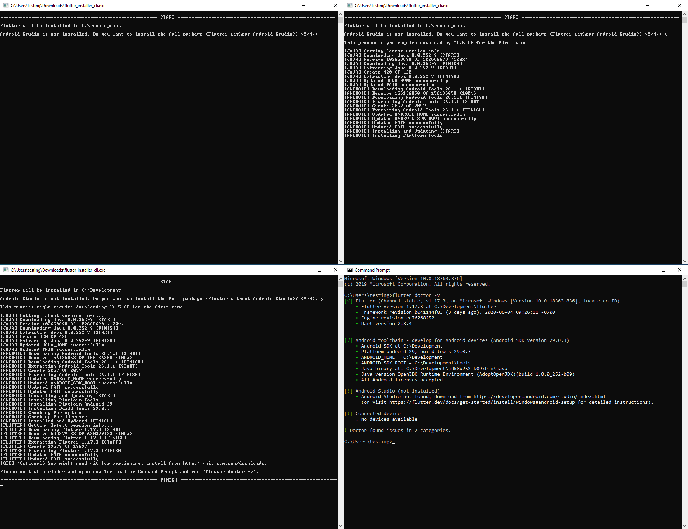

# Flutter Installer

[](https://github.com/daffaalam/flutter_installer_cli/issues)
[](https://github.com/daffaalam/flutter_installer_cli/network)
[](https://github.com/daffaalam/flutter_installer_cli/stargazers)
[](https://github.com/daffaalam/flutter_installer_cli/blob/master/LICENSE)

English | [Indonesia](README.md)

Installation toolkit for Flutter SDK, including Android SDK and Java SDK if not installed (automatic detection). If you cannot use github issues, you can contact directly to Telegram [@daffaalam](https://t.me/daffaalam).

## How to run

**Download [HERE](https://github.com/daffaalam/flutter_installer_cli/releases/latest), extract and run right away.**

Please remember the system requirements ([windows](https://flutter.dev/docs/get-started/install/windows#system-requirements)/[linux](https://flutter.dev/docs/get-started/install/linux#system-requirement)/[macos](https://flutter.dev/docs/get-started/install/macos#system-requirement)) needed before running this application. On Linux and MacOS if it doesn't work or there is a permission error, please do `chmod +x flutter_installer_cli` first.

Please report to [issues](https://github.com/daffaalam/flutter_installer_cli/issues) if it fails or something wrong.

### Custom Installation Path

By default flutter will be installed in `C:\Development` for Windows and `~/Development` for Linux and MacOS. For custom installation path you can use the `path` flag.

For Windows example:
```
.\flutter_installer_cli.exe --path E:\Dev
```
or for Linux and MacOS example:
```
./flutter_installer_cli --path /home/user/Dev
```

### Custom Flutter Version

By default it will take the latest flutter version from the stable channel. If you want to use another version, use the `channel` and `version` flags. Use the version name from https://flutter.dev/docs/development/tools/sdk/releases.

For example to get the latest beta channel:
```
./flutter_installer_cli --channel beta
```
you can also choose the version:
```
./flutter_installer_cli --version v1.12.13+hotfix.9
```
and can also combine two flags:
```
./flutter_installer_cli --channel beta --version v1.14.6
```

If the `version` and `channel` do not find a match, it will retrieve the latest this channel version (by default it is a stable channel).

## Screenshots



## Features

- [x] Windows, Linux, and MacOS support.
- [x] Detects whether Android Studio and or Visual Studio Code is already installed.
- [x] Detects whether Android SDK, Java SDK and Flutter SDK are installed.
- [x] Check the latest versions of Android SDK, Java SDK, and Flutter SDK.
- [x] Install Android SDK, Java SDK, and Flutter SDK.
- [x] Install Flutter and Dart plugin for Visual Studio Code and Android Studio.
- [x] Choose the previous flutter version.
- [x] Choose a custom installation path.

## TODO

- [ ] high - Implementation to the GUI (flutter) version.
- [ ] low - Documentation of each code and feature.
- [ ] low - Language improvement (I'm very bad at English).
- [ ] low - Clean code.

## Contributing (Only for Developers)

When contributing to this repository, please first discuss the change you wish to make via [github issues](https://github.com/daffaalam/flutter_installer_cli/issues), [email](mailto:daffaalam@gmail.com), or [any other method](https://daffaalam.com/profile) with the owners of this repository before making a change.

## Running the tests

1. Create a new virtual machine with VirtualBox or something.
2. Run it from Command Prompt, PowerShell, or Terminal, don't run it from double click, so you can see the crash message before the program exits.

## Deployment

1. Clone or download this [repository](https://github.com/daffaalam/flutter_installer_cli).
2. Install `Dart` from https://dart.dev/get-dart.
3. Run on project: `dart2native bin/flutter_installer_cli.dart`.
4. Tip: If you don't have MacOS, you can use CI/CD [Codemagic](https://codemagic.io/) or [Gitlab](https://docs.gitlab.com/ee/ci/README.html).

## Other

(Obsolete) Batch file (.bat) version [here](https://github.com/daffaalam/flutter-installer).

## License

This project is licensed under the MIT License - see the [LICENSE](LICENSE) file for details.
