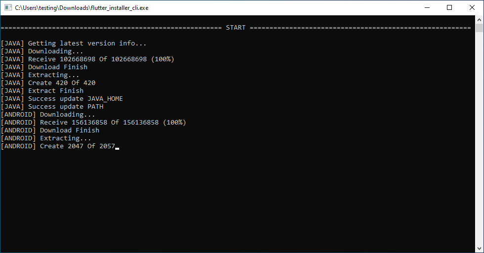
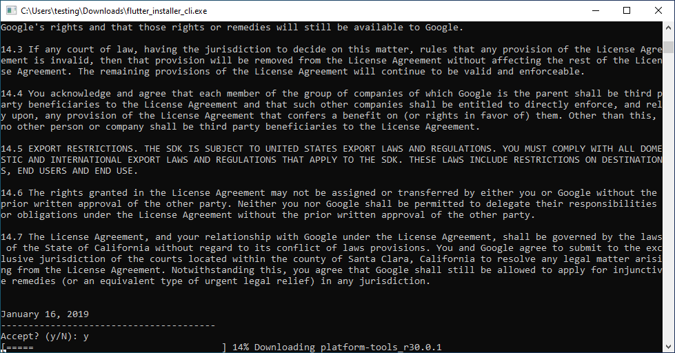
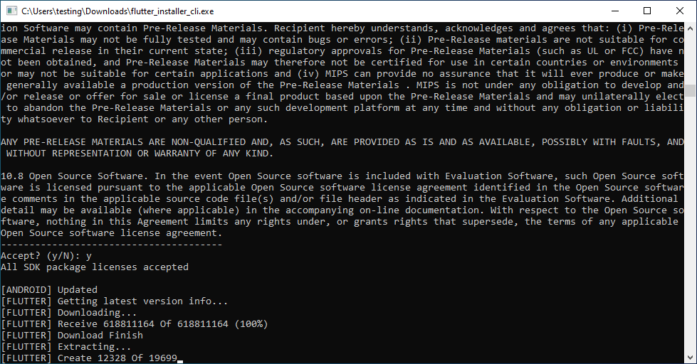
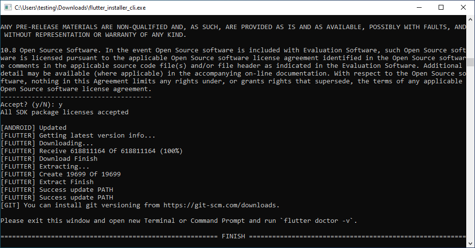

# Flutter Installer

### Download [here](https://github.com/daffaalam/flutter_installer_dart/releases/download/v0.2.0/flutter_installer_cli.exe)

### Screenshots

### Features

- Read exists Android Sdk, Java Sdk, and Flutter Sdk
- Check for latest version of Android Sdk, Java Sdk, and Flutter Sdk
- Installing Android Sdk, Java Sdk, and Flutter Sdk

### How to build

1. Clone or download this repo.
2. Install `Dart` from https://dart.dev/get-dart or https://gekorm.com/dart-windows/
3. Run on project `dart2native bin/flutter_installer_cli.dart`

### TODO

- [low] Fix and create multi language
- [high] Implement for Linux and Mac
- [low] Pretty and simple code
- [high] Create and send log for analyzing error
- [low] Check for exists Android Studio

### Other

Batch file (.bat) version [here](https://github.com/daffaalam/flutter-installer).

***

Created from templates made available by Stagehand under a BSD-style
[license](https://github.com/dart-lang/stagehand/blob/master/LICENSE).
