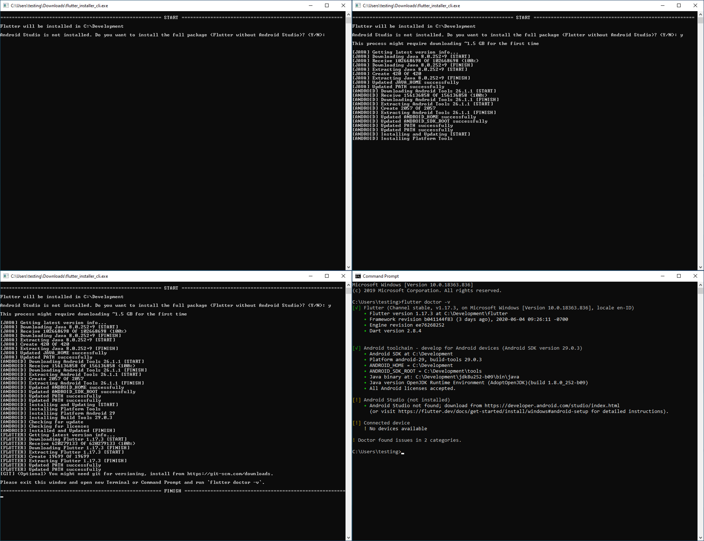

# Flutter Installer

[](https://github.com/daffaalam/flutter_installer_cli/issues)
[](https://github.com/daffaalam/flutter_installer_cli/network)
[](https://github.com/daffaalam/flutter_installer_cli/stargazers)
[](https://github.com/daffaalam/flutter_installer_cli/blob/master/LICENSE)

[English](README-en.md) | Indonesia

Toolkit instalasi untuk Flutter SDK, termasuk Android SDK dan Java SDK jika belum diinstal (deteksi otomatis).

## Cara Menjalankannya

**Unduh [DI SINI](https://github.com/daffaalam/flutter_installer_cli/releases/latest), ekstrak dan jalankan segera.**

Harap ingat persyaratan sistem ([windows](https://flutter.dev/docs/get-started/install/windows#system-requirements)/[linux](https://flutter.dev/docs/get-started/install/linux#system-requirement)/[macos](https://flutter.dev/docs/get-started/install/macos#system-requirement)) yang diperlukan sebelum menjalankan aplikasi ini. Pada Linux dan MacOS jika tidak dapat dijalankan atau terjadi kesalahan terkait perizinan silakan lakukan `chmod +x flutter_installer_cli` terlebih dahulu.

Tolong laporkan ke [issues](https://github.com/daffaalam/flutter_installer_cli/issues) jika gagal atau ada yang salah. Jika tidak bisa menggunakan github issues boleh kontak langsung ke Telegram [@daffaalam](https://t.me/daffaalam).

### Jalur Instalasi Kustom

Secara default flutter akan diinstal di `C:\Development` untuk Windows dan `~/Development` untuk Linux dan MacOS. Untuk jalur instalasi khusus Anda dapat menggunakan flag `path`.

Sebagai contoh pada Windows:
```
.\flutter_installer_cli.exe --path E:\Dev
```
atau contoh pada Linux dan MacOS:
```
./flutter_installer_cli --path /home/user/Dev
```

### Versi Flutter Kustom

Secara default, ini akan mengambil versi flutter terbaru dari channel stable. Jika Anda ingin menggunakan versi lain, gunakan flag `channel` dan `version`. Gunakan nama versi dari https://flutter.dev/docs/development/tools/sdk/releases.

Contoh untuk mendapatkan channel beta terbaru:
```
./flutter_installer_cli --channel beta
```
Anda juga dapat memilih versi:
```
./flutter_installer_cli --version v1.12.13+hotfix.9
```
dan juga dapat menggabungkan kedua flag:
```
./flutter_installer_cli --channel beta --version v1.14.6
```

Jika `version` dan `channel` tidak menemukan kecocokan, itu akan mengambil versi terbaru pada channel tersebut (secara default adalah channel stable).

## Tangkapan Layar



## Fitur

- [x] Dukungan Windows, Linux, dan MacOS.
- [x] Mendeteksi apakah Android Studio dan atau Visual Studio Code sudah diinstal.
- [x] Mendeteksi apakah Android SDK, Java SDK dan Flutter SDK sudah diinstal.
- [x] Memeriksa versi terbaru Android SDK, Java SDK, dan Flutter SDK.
- [x] Menginstal Android SDK, Java SDK, dan Flutter SDK.
- [x] Menginstal plugin Flutter dan Dart untuk Visual Studio Code dan Android Studio.
- [x] Memilih versi Flutter sebelumnya.
- [x] Memilih jalur instalasi khusus.

## TODO

- [ ] tinggi - Implementasi ke versi GUI (flutter).
- [ ] rendah - Dokumentasi tiap code dan fitur.
- [ ] rendah - Improvisasi bahasa.
- [ ] rendah - Clean code.

## Berkontribusi (Hanya Untuk Pengembang)

Ketika ingin berkontribusi pada repositori ini, silakan bahas terlebih dahulu perubahan yang ingin Anda lakukan melalui [github issues](https://github.com/daffaalam/flutter_installer_cli/issues), [email](mailto:daffaalam@gmail.com), atau [metode lain](https://daffaalam.com/profile) dengan pemilik repositori ini sebelum melakukan perubahan.

### Menjalankan Tes

1. Buat mesin virtual baru dengan VirtualBox atau semacamnya.
2. Jalankan dari Command Prompt, PowerShell, atau Terminal, jangan jalankan langsung dari double klik, sehingga Anda dapat melihat pesan gagal sebelum program keluar.

### Deployment

1. Clone atau unduh [repositori](https://github.com/daffaalam/flutter_installer_cli) ini.
2. Instal `Dart` dari https://dart.dev/get-dart.
3. Jalankan dalam proyek: `dart2native bin/flutter_installer_cli.dart`.
4. Tips: Jika Anda tidak memiliki MacOS, Anda bisa gunakan CI/CD [Codemagic](https://codemagic.io/) atau [Gitlab](https://docs.gitlab.com/ee/ci/README.html).

## Lainnya

(Usang) Versi file batch (.bat) [di sini](https://github.com/daffaalam/flutter-installer).

## Lisensi

Proyek ini dilisensikan di bawah Lisensi MIT - lihat file [LICENSE](LICENSE) untuk detailnya.
